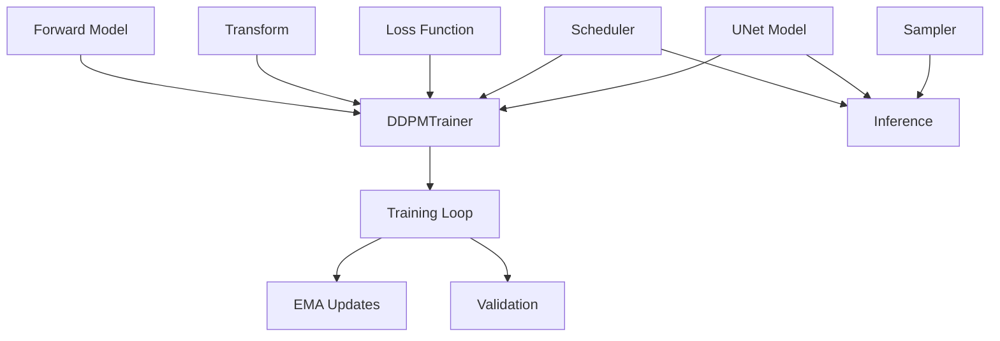
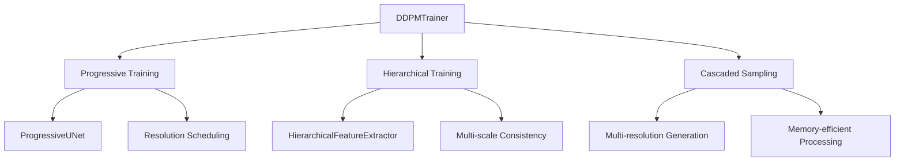

# PKL Diffusion Models Architecture

This document provides a comprehensive overview of the modular architecture used in the PKL Diffusion models package, explaining the relationships between components and how they work together.

## 🏗️ Architecture Overview

The PKL Diffusion models package follows a **modular, registry-based architecture** inspired by modern ML frameworks like HuggingFace Diffusers and Transformers. This design promotes:

- **Modularity**: Each component has a single responsibility
- **Extensibility**: Easy to add new schedulers, samplers, etc.
- **Composability**: Components can be mixed and matched
- **Type Safety**: Strong typing and validation
- **Plugin Architecture**: Components are automatically discovered and registered

## 📦 Module Structure

```
pkl_dg/models/
├── __init__.py              # Package exports and initialization
├── registry.py              # Component registry system (NEW)
├── factory.py               # Enhanced factory functions (NEW)
├── diffusion.py             # Core DDPM trainer (1,641 lines)
├── unet.py                  # UNet architecture (350 lines)
├── schedulers.py            # Noise schedulers (485 lines)
├── sampler.py               # Sampling algorithms (515 lines)
├── losses.py                # Loss functions (709 lines)
├── nn.py                    # Neural network building blocks (567 lines)
├── progressive.py           # Progressive training (849 lines)
├── cascaded_sampling.py     # Multi-resolution sampling (843 lines)
├── hierarchical_strategy.py # Hierarchical training (930 lines)
└── ARCHITECTURE.md          # This documentation (NEW)
```

## 🔧 Component Registry System

The new registry system provides centralized component management following the HuggingFace pattern:

### Registry Types

| Registry | Purpose | Components |
|----------|---------|------------|
| `SCHEDULER_REGISTRY` | Noise scheduling strategies | Linear, Cosine, Exponential, etc. |
| `SAMPLER_REGISTRY` | Sampling algorithms | DDIM, DDPM, Ancestral |
| `LOSS_REGISTRY` | Loss functions | MSE, L1, Perceptual, Fourier |
| `MODEL_REGISTRY` | Model architectures | UNet, Progressive UNet |
| `STRATEGY_REGISTRY` | Training strategies | Hierarchical, Progressive |

### Usage Examples

```python
from pkl_dg.models import create_scheduler, create_sampler

# Modern registry-based usage
scheduler = create_scheduler("cosine", num_timesteps=1000, s=0.008)
sampler = create_sampler("ddim", model=model, ddim_steps=50)

# Automatic component discovery
from pkl_dg.models import get_available_components
print(get_available_components())
```

## 🔄 Component Relationships

### Core Training Flow



### Advanced Features Integration



## 🎯 Design Principles

### 1. Single Responsibility Principle
Each module has one clear purpose:
- `schedulers.py`: Only noise scheduling
- `sampler.py`: Only sampling algorithms  
- `losses.py`: Only loss functions
- `diffusion.py`: Only core training logic

### 2. Composition over Inheritance
Components are composed rather than inherited:
```python
# Good: Composition
trainer = DDPMTrainer(
    model=unet,
    scheduler=cosine_scheduler,
    sampler=ddim_sampler,
)

# Avoid: Deep inheritance hierarchies
```

### 3. Plugin Architecture
New components are easily added via decorators:
```python
@register_scheduler("my_scheduler")
class MyScheduler(BaseScheduler):
    def get_betas(self):
        # Implementation
        pass
```

### 4. Graceful Degradation
Advanced features degrade gracefully when dependencies are missing:
```python
try:
    from .advanced_features import AdvancedComponent
    ADVANCED_AVAILABLE = True
except ImportError:
    ADVANCED_AVAILABLE = False
```

## 🚀 Factory Functions

The new factory system provides multiple creation patterns:

### 1. Simple Creation
```python
from pkl_dg.models.factory import ModelFactory

# Create complete trainer
trainer = ModelFactory.create_trainer(
    scheduler_type="cosine",
    sampler_type="ddim"
)
```

### 2. Preset Configurations
```python
from pkl_dg.models.factory import create_from_preset

# Use preset for common scenarios
trainer = create_from_preset("microscopy_2p", image_size=512)
trainer = create_from_preset("fast_inference", num_steps=25)
trainer = create_from_preset("high_quality", image_size=1024)
```

### 3. Configuration Files
```python
# Load from YAML/JSON
trainer = ModelFactory.from_config_file("config.yaml")
```

## 📚 Module Dependencies

### Core Dependencies
```
diffusion.py
├── nn.py (building blocks)
├── schedulers.py (noise scheduling)
├── losses.py (loss functions)
└── registry.py (component system)
```

### Advanced Dependencies
```
progressive.py
├── diffusion.py (base trainer)
└── schedulers.py (resolution-aware scheduling)

hierarchical_strategy.py
├── diffusion.py (base trainer)
├── progressive.py (progressive base)
└── schedulers.py (hierarchical scheduling)

cascaded_sampling.py
├── sampler.py (base sampling)
└── schedulers.py (multi-resolution scheduling)
```

## 🔍 Component Interfaces

### Base Classes
All components inherit from standardized base classes:

```python
# Schedulers
class BaseScheduler(ABC):
    @abstractmethod
    def get_betas(self) -> torch.Tensor:
        pass

# Samplers  
class BaseSampler(ABC):
    @abstractmethod
    def sample(self, *args, **kwargs) -> torch.Tensor:
        pass

# Losses
class BaseLoss(nn.Module):
    @abstractmethod
    def forward(self, pred, target) -> torch.Tensor:
        pass
```

### Registry Interface
All components can be registered and created uniformly:

```python
# Registration (automatic via decorators)
@register_scheduler("my_scheduler")
class MyScheduler(BaseScheduler):
    pass

# Creation (uniform interface)
component = SCHEDULER_REGISTRY.create("my_scheduler", **config)
```

## 🎨 Extension Patterns

### Adding New Schedulers
```python
from pkl_dg.models.registry import register_scheduler
from pkl_dg.models.schedulers import BaseScheduler

@register_scheduler(
    name="my_scheduler",
    aliases=["custom", "experimental"],
    config={"default_param": 1.0}
)
class MyScheduler(BaseScheduler):
    def __init__(self, num_timesteps=1000, default_param=1.0):
        super().__init__(num_timesteps)
        self.param = default_param
    
    def get_betas(self):
        # Implementation
        return torch.linspace(0.0001, 0.02, self.num_timesteps)
```

### Adding New Samplers
```python
from pkl_dg.models.registry import register_sampler
from pkl_dg.models.sampler import BaseSampler

@register_sampler(
    name="my_sampler",
    config={"num_steps": 50}
)
class MySampler(BaseSampler):
    def sample(self, shape, device, **kwargs):
        # Implementation
        return torch.randn(shape, device=device)
```

## 🧪 Testing Strategy

### Component Testing
Each module is tested independently:
```python
# Test scheduler in isolation
def test_cosine_scheduler():
    scheduler = create_scheduler("cosine", num_timesteps=100)
    betas = scheduler.get_betas()
    assert len(betas) == 100

# Test sampler in isolation  
def test_ddim_sampler():
    sampler = create_sampler("ddim", model=mock_model)
    samples = sampler.sample(shape=(1, 1, 64, 64))
    assert samples.shape == (1, 1, 64, 64)
```

### Integration Testing
Components are tested together:
```python
def test_trainer_integration():
    trainer = ModelFactory.create_trainer(
        scheduler_type="cosine",
        sampler_type="ddim"
    )
    # Test training loop
    loss = trainer.training_step(batch, 0)
    assert isinstance(loss, torch.Tensor)
```

## 📈 Performance Considerations

### Memory Optimization
- **Lazy Loading**: Components loaded only when needed
- **Registry Caching**: Components cached after first creation
- **Graceful Fallbacks**: Optional dependencies don't block core functionality

### Computational Efficiency
- **Factory Caching**: Expensive factory operations cached
- **Component Reuse**: Components shared across similar configurations
- **Batch Processing**: Registry operations batched when possible

## 🔮 Future Enhancements

### Planned Improvements
1. **Dynamic Plugin Loading**: Load components from external packages
2. **Configuration Validation**: Enhanced config validation with schemas
3. **Component Versioning**: Version management for component compatibility
4. **Performance Profiling**: Built-in profiling for component performance
5. **Auto-tuning**: Automatic hyperparameter optimization

### Extension Points
- **Custom Registries**: Create domain-specific component registries
- **Component Composition**: Higher-order components that combine others
- **Pipeline Optimization**: Automatic pipeline optimization based on hardware

## 📖 Best Practices

### Do's ✅
- Use registry system for component creation
- Follow single responsibility principle
- Provide clear interfaces and documentation
- Use composition over inheritance
- Handle optional dependencies gracefully

### Don'ts ❌
- Don't create monolithic files (keep modules focused)
- Don't tightly couple components
- Don't hardcode component types (use registry)
- Don't skip error handling and validation
- Don't forget backward compatibility

## 🤝 Contributing

When adding new components:

1. **Follow the Interface**: Inherit from appropriate base class
2. **Use Registry**: Register component with `@register_*` decorator
3. **Add Tests**: Include unit and integration tests
4. **Update Docs**: Add documentation and examples
5. **Validate Config**: Ensure configuration validation works
6. **Handle Dependencies**: Use optional imports for external dependencies

This architecture ensures the PKL Diffusion models package remains maintainable, extensible, and follows industry best practices while providing powerful functionality for diffusion model research and applications.
